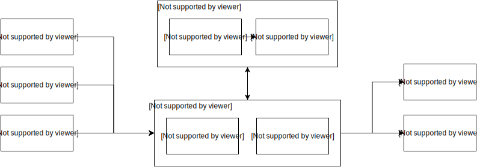

# ArducamIMX500SDK


## Overview



---

| Function | Support |
|----------|---------|
|Model input type| RGB, Y, YUV444, BGR, BAYER|
| Data injection image type | .jpg, .jpeg, .png, .bmp, .tif, .tiff, .webp, .ppm, .pgm, .pbm |
|Model config file| Config preprocess of input image by network_info.txt |
|Multi Model FPK| support |
| Model Size (quantified) | <= 8 MB |
| Model input data size (uint8) | <= 640 x 480 x 3 |
| Task Converage | classification, object detection, pose estimation, segmentation |
## Install

Please visit the [Releases](https://github.com/ArduCAM/ArducamIMX500SDK/releases/latest) page and download the corresponding `.whl` installation package based on your operating system and Python version.

After downloading, install it using the following command:

```bash
pip install your_package_name‑<version>‑<python_version>‑<platform>.whl
```

### Example

Suppose you are using Windows and Python 3.8, and the downloaded file is:

```
arducamimx500sdk‑1.2.2‑cp38‑cp38‑win_amd64.whl
```

Then run the following command in the terminal:

```bash
pip install arducamimx500sdk‑1.2.2‑cp38‑cp38‑win_amd64.whl
```


## Simple and Powerful API

ArducamIMX500SDK is designed to be both **easy to use** and **highly extensible**. Whether you're looking for a plug-and-play AI camera experience or planning to build complex computer vision pipelines, this SDK offers a clean and flexible Python interface.

### 🚀 Get Started

Clone this repository and run the following command in the project directory:

```bash
git submodule update --init --recursive

cd examples
# mobilenetv2
python app.py -pm mobilenetv2 -lf ..\firmware\arducam_imx500\loader.fpk -mf ..\firmware\arducam_imx500\firmware.fpk
# mobilenetssd
python app.py -pm mobilenetssd -lf ..\firmware\arducam_imx500\loader.fpk -mf ..\firmware\arducam_imx500\firmware.fpk
# yolov8n_det
python app.py -pm yolov8n_det -lf ..\firmware\arducam_imx500\loader.fpk -mf ..\firmware\arducam_imx500\firmware.fpk
# yolov8n_pos
python app.py -pm yolov8n_pos -lf ..\firmware\arducam_imx500\loader.fpk -mf ..\firmware\arducam_imx500\firmware.fpk
# yolov8n_pos_hand
python app.py -pm yolov8n_pos_hand -lf ..\firmware\arducam_imx500\loader.fpk -mf ..\firmware\arducam_imx500\firmware.fpk
# deeplabv3plus
python app.py -pm deeplabv3plus -lf ..\firmware\arducam_imx500\loader.fpk -mf ..\firmware\arducam_imx500\firmware.fpk
```

### Sample App

```bash
git submodule update --init --recursive

cd examples
# geofencing
python app.py -dp geofencing -lf ..\firmware\arducam_imx500\loader.fpk -mf ..\firmware\arducam_imx500\firmware.fpk
# detect and count package
python app.py -dp package -lf ..\firmware\arducam_imx500\loader.fpk -mf ..\firmware\arducam_imx500\firmware.fpk
```

### Command-line Options

```bash
usage: app.py [-h] [-wf] [-lf LOADER_FIRMWARE] [-mf MAIN_FIRMWARE] [-m MODEL] [-dp DEMO_PROJECT] [-pm PRETRAIN_MODEL]
              [-d DEVICE_ID] [-dy] [-dyr] [-di DATA_INJECTION] [--network-info NETWORK_INFO] [--rect-crop XMIN YMIN XMAX YMAX]   

options:
  -h, --help            show this help message and exit
  -wf, --write-flash    Flag of flash write.
  -lf LOADER_FIRMWARE, --loader-firmware LOADER_FIRMWARE
                        Loader firmware path.
  -mf MAIN_FIRMWARE, --main-firmware MAIN_FIRMWARE
                        Main firmware path.
  -m MODEL, --model MODEL
                        Model path.
  -dp DEMO_PROJECT, --demo-project DEMO_PROJECT
                        Demo project name.
  -pm PRETRAIN_MODEL, --pretrain-model PRETRAIN_MODEL
                        Pretrain model name.
  -d DEVICE_ID, --device-id DEVICE_ID
                        Device Index. (default: 0)
  -dy, --dump-yuv       Dump YUV.
  -dyr, --dump-yuv-raw  Dump raw YUV.
  -di DATA_INJECTION, --data-injection DATA_INJECTION
                        Data injection.
  --network-info NETWORK_INFO
                         network_info.txt path
  --rect-crop XMIN YMIN XMAX YMAX
                         Rect crop area in absolute xyxy format. X range: 0-4056, Y range: 0-3040.
```

### Data Injection Export Example

`examples/data_injection_export.py` is a one-shot data injection helper for offline export.

```bash
cd examples
# Use pretrain model
python data_injection_export.py -pm mobilenetssd -lf ..\firmware\arducam_imx500\loader.fpk -mf ..\firmware\arducam_imx500\firmware.fpk -i ..\pics\test.jpg -o .\outputs --fps 20

# Or use custom model path
python data_injection_export.py -m ..\model\arducam_imx500_model_zoo\mobilenetssd\network.fpk -lf ..\firmware\arducam_imx500\loader.fpk -mf ..\firmware\arducam_imx500\firmware.fpk -i ..\pics\test.jpg -o .\outputs --fps 20

# Batch mode: -i can be a directory
python data_injection_export.py -pm mobilenetssd -lf ..\firmware\arducam_imx500\loader.fpk -mf ..\firmware\arducam_imx500\firmware.fpk -i ..\pics\test -o .\outputs --fps 20
```

Outputs are generated in `-o/<input_image_stem>/` and include:
- `image.png`
- `input_tensor.png`
- `parsed_metadata.json`

## Ready for Advanced Development

If you plan to build your own applications, pipelines, or integrate with other systems, these APIs give you the control and flexibility you need.

📚 **For full API reference and data structures**, please refer to the official documentation:
[**ArducamIMX500SDK.pdf**](https://github.com/ArduCAM/ArducamIMX500SDK/releases/latest/download/ArducamIMX500SDK.pdf)

This document includes detailed explanations of class methods, parameter definitions, and usage examples — essential for anyone doing secondary development on the Arducam IMX500 platform.

