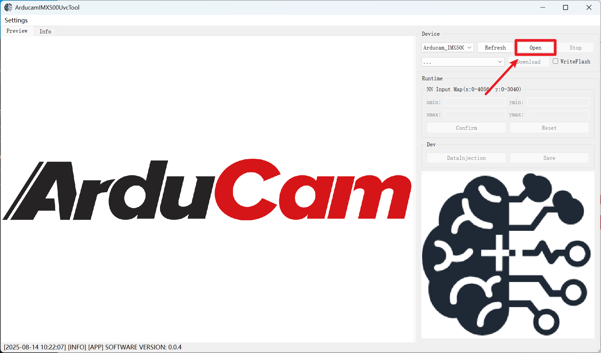
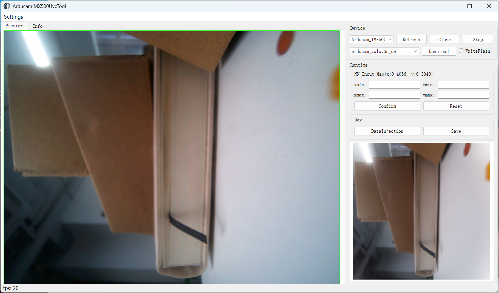
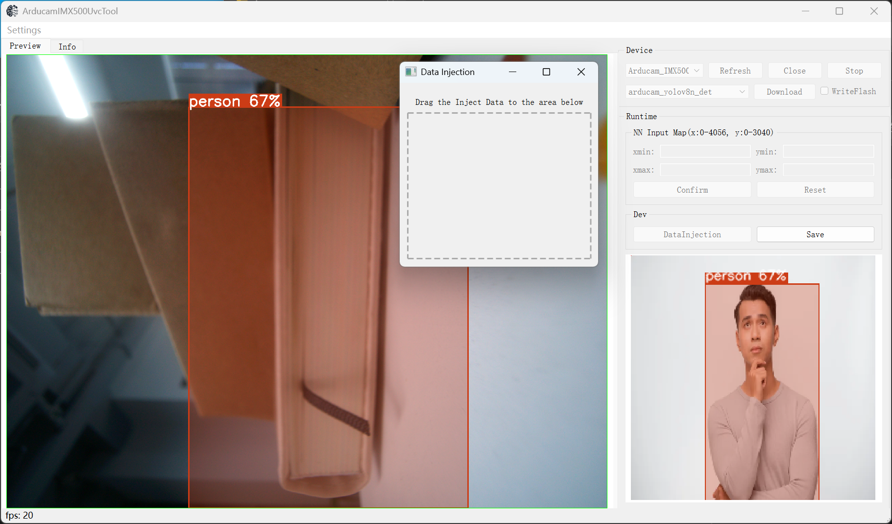
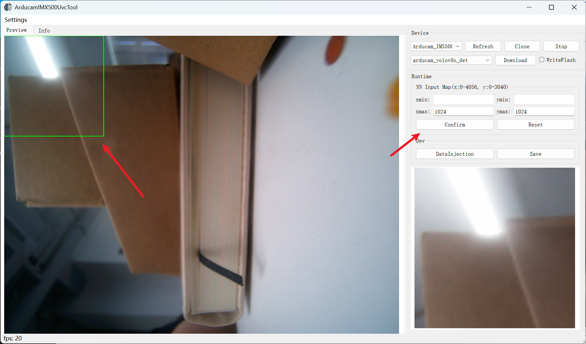

# ArducamIMX500UvcTool User Manual

## Quick Start

1. Connect the IMX500 UVC to the host PC via a USB 3.0 port
2. Double-click `ArducamIMX500UvcTool_Release.exe` to launch the application
3. Click `Open` to open the camera
   
4. Select the model `arducam_yolov8n_det` and click `Download` to download the model
5. Once the download is complete, the image will be displayed
   

## Using a Custom Model

1. After the camera is opened, click `...` to select a custom model file
2. Click `Download` to download the model
3. Once the download is complete, the image will be displayed

## Data Injection

1. After the model is successfully loaded, the `Runtime` function group will be enabled
2. Click `DataInjection` to open the injection window
3. Drag and drop an image file into the window to complete injection

## Rect Crop NN Input Map

Below is the optimized **"Rect Crop NN Input Map"** section, maintaining technical accuracy while enhancing readability and operational clarity:

---

## Rect Crop NN Input Map

This feature allows users to crop a specified region from the sensor image to be used as the model input image, suitable for inference focused on a specific area.

1. After opening the camera and successfully loading the model, go to the `NN Input Map` group on the right toolbar;
2. Set the crop region coordinates in the input fields:

   * **xmin**: X coordinate of the top-left corner (range: 0 \~ 4056)
   * **ymin**: Y coordinate of the top-left corner (range: 0 \~ 3040)
   * **xmax**: X coordinate of the bottom-right corner (range: 0 \~ 4056)
   * **ymax**: Y coordinate of the bottom-right corner (range: 0 \~ 3040)
3. Click the `Confirm` button, and the system will use the selected region as the model input image;
4. Once set successfully, the model will perform inference only within this region.

## Data Saving

1. After the model is successfully loaded, click `Save`
2. Select the save directory, and the data will be automatically saved to it

## Issue Reporting

If you encounter any problems, please keep the program running, navigate to the software directory, locate `log.txt`, and send it to the developers to help diagnose the issue.
